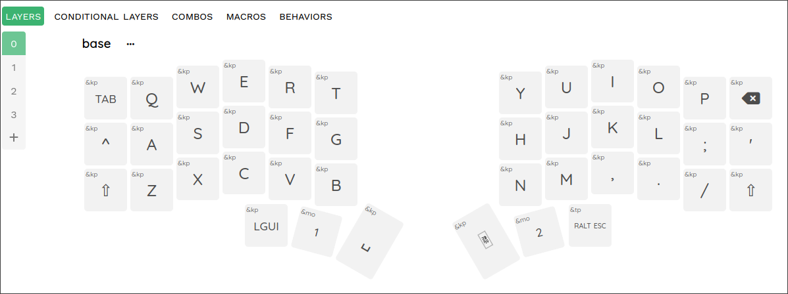
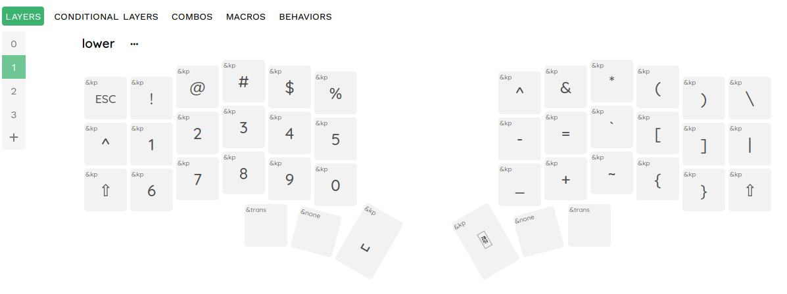
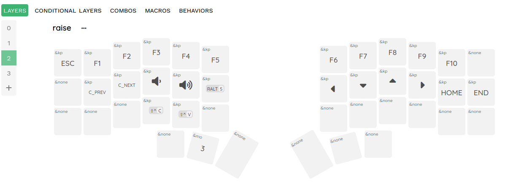
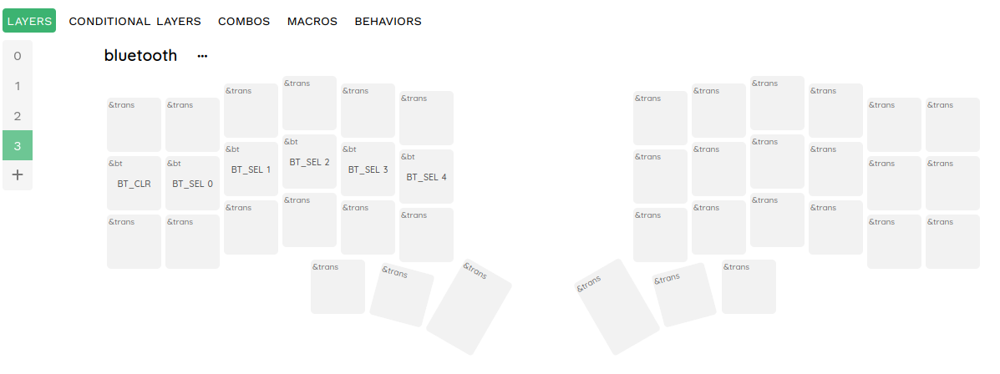

# Corne Wireless Mechanical Keyboard configuration

## Config v1.4

### Layers

---

- [keymap-editor](https://github.com/nickcoutsos/keymap-editor)
- [Keymap Drawer](https://keymap-drawer.streamlit.app/)
